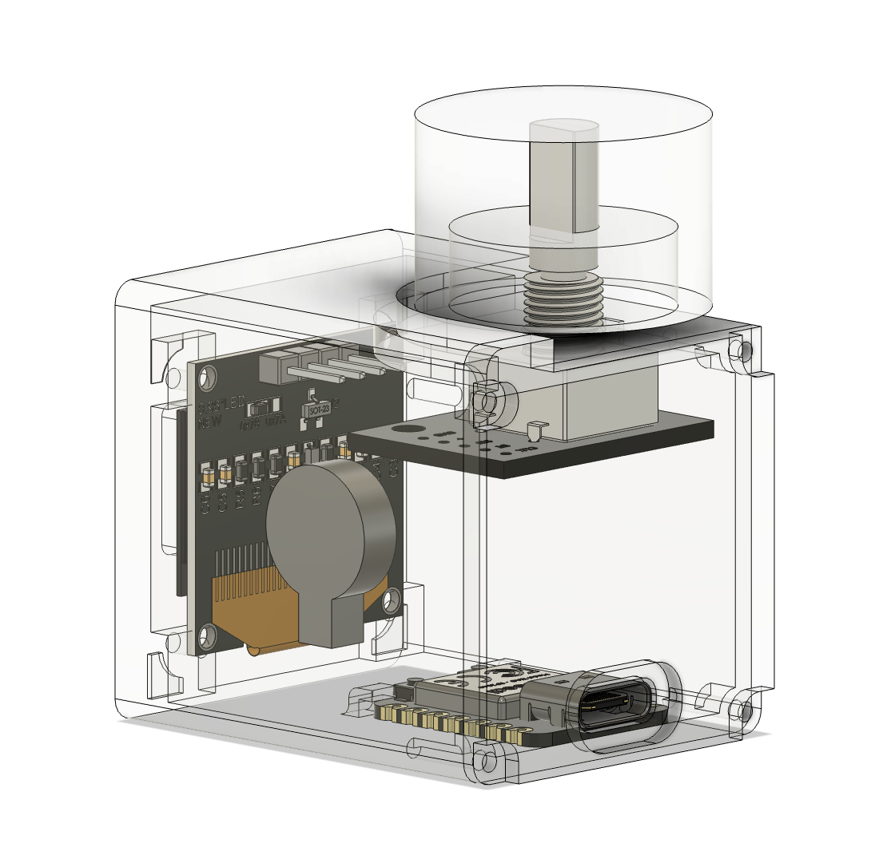

# Table Timer

A tiny desk clock to remind me to stay mobile in my office work.  
During work hours, on the hour, the motor will vibrate and the animation will change from a work-computer animation to an active-sport animation.

In the morning the clock will show a sunshine animation, at lunch time, a food animation, at 16:00 a coffee cup, and after work hours, a little house.

## Mechanical Design

The mechanical design of the enclosure was challenging since I wanted to keep the size small but still have a good fit for the components without struggling too much with the assembly.

I 3D printed the enclosure on a BambuLab A1 mini using PLA plastic with some supports without any issues.

## Electronics

I used a XIAO RP2040 microcontroller board for the main microcontroller since it's small and neat. 
Additionally, I added a 128x64 OLED display connected via I2C, a rotary encoder for adjusting time, and a small vibration motor.

## Software

I took all the animations from (https://animator.wokwi.com)[https://animator.wokwi.com]. They offer a large collection of free bitmap animations and it's easy to implement them in the code.

Other than that, the code is mostly straightforward and involving keeping track of time and updating the display based on the current time.

